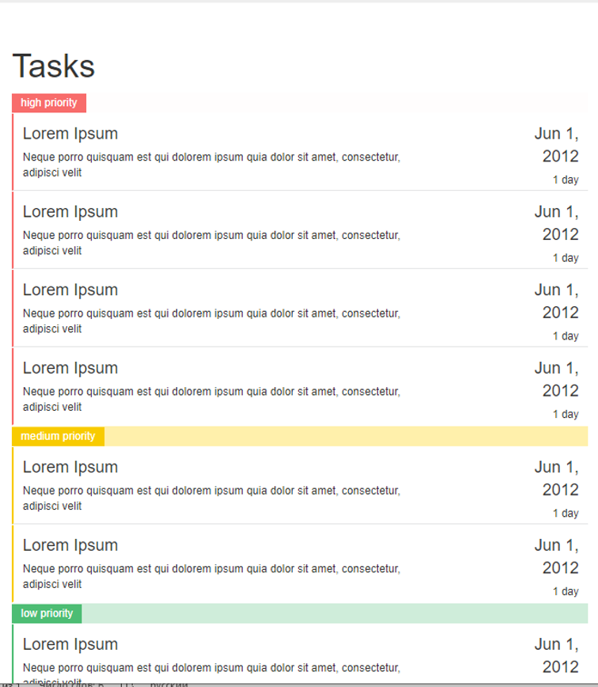

# Задача 1
При помощи Bootstrap, HTML и css реализовать верстку сайта списка задач (итоговый вариант на рисунке ниже)

  

# Задача 2
Реализовать страницу представления команды разработки. Использовать HTML, CSS, Bootstap. 

  

# 3 задача
Сделайте верстку страницы авторизации и регистрации по аналогу соответствующих страниц Github’а. Использовать HTML, Css, Bootstrap

# Дополнительная задача
Сделать верстку сайта по [Figma макету](https://www.figma.com/file/5D9pDuLtS042hzaoN69Kd7/Free--Landing--Page-Template?node-id=0%3A1)
